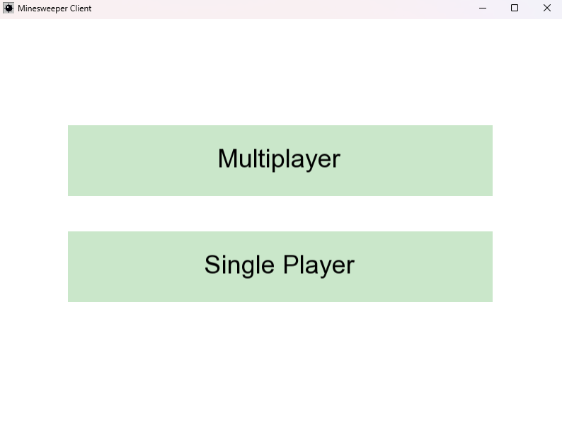
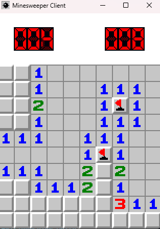
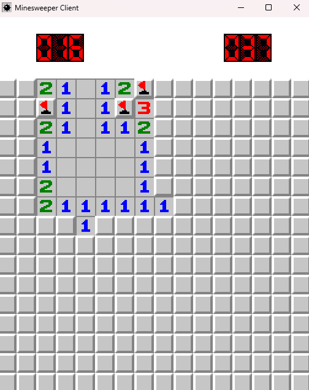
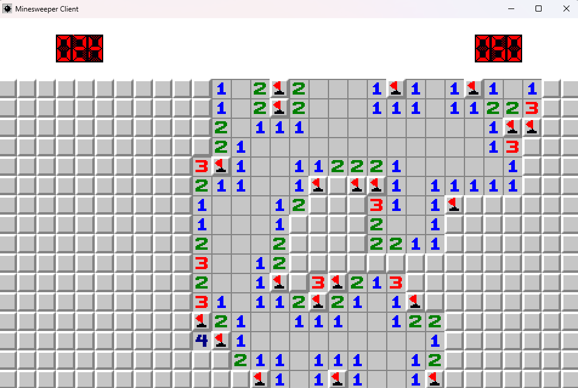

# 💣 Minesweeper 1v1

> A competitive two-player Minesweeper game with three difficulty modes, built in C++ with SFML.



---

## About

A twist on classic Minesweeper. Two players race to clear their board, first to finish wins. Built as a collaborative project with a focus on clean game logic and smooth rendering via SFML.

> **Co-developed with [@SNCSamitek](https://github.com/SNCSamitek)**

---

## Features

- 🆚 1v1 competitive gameplay
- 🎚️ Three difficulty modes — Easy, Medium, Hard
- 🖱️ Full Minesweeper Game (Singleplayer Included)
- 🏆 Win detection and game-over states
- 🎨 SFML-powered rendering with clean UI
- 🎬 Scene Managed Architecture

---

## Screenshots

| Easy | Medium | Hard |
|-----------|-----------|-----------|
|  |  |  |

---

## Tech Stack

- **Language:** C++
- **Graphics:** SFML
- **Build System:** CMake

---

## Getting Started

### Prerequisites

- CMake ≥ 3.16
- SFML installed on your system
- A C++ Compiler
- Python (Or figuring out the cmake install on your own)

### Build

```bash
git clone https://github.com/KingOws/minesweeper-1v1
cd minesweeper-1v1
py build.py
py run.py src
```

---

## Left to Complete

- Networking

---

## Authors

- [@KingOws](https://github.com/KingOws)
- [@SNCSamitek](https://github.com/SNCSamitek)
